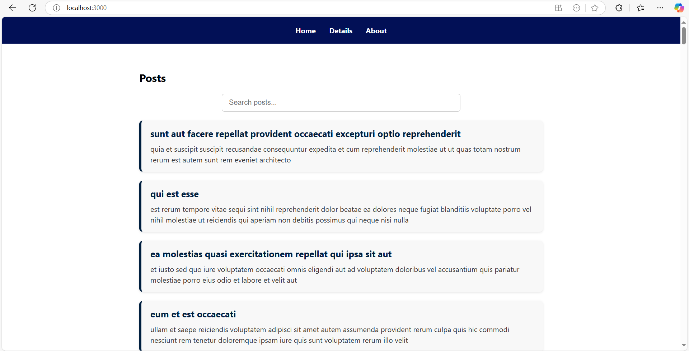
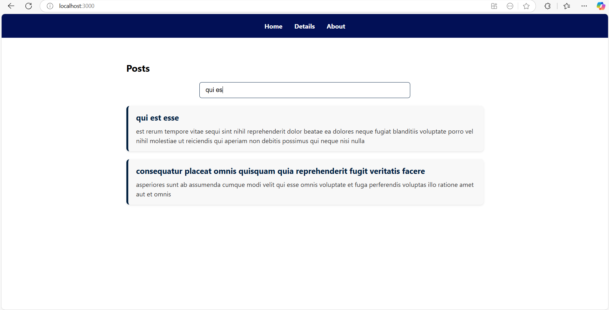
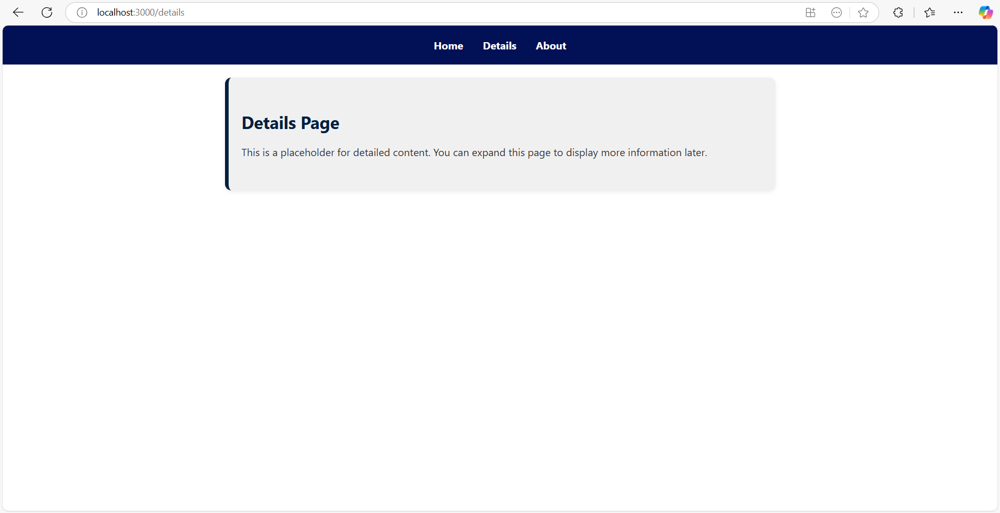
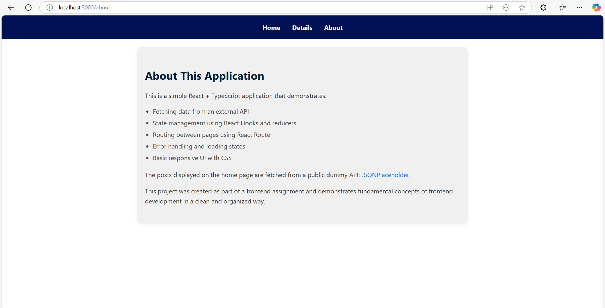

# React + TypeScript Frontend Assignment

This is a React frontend application built with TypeScript. It includes routing, state management, API calls, and basic UI for the following pages:

- **Home Page**
- **Details Page**
- **About Page**

## Features

- **Routing:** Navigates between pages (Home, Details, About) using React Router.
- **State Management:** Manages application state with React's `useState` and `useEffect`.
- **API Calls:** Fetches data from APIs to display dynamic content.
- **TypeScript Integration:** Type safety and autocompletion across the codebase using TypeScript.

## Setup

To get started with this project, follow these steps:

1. **Clone the repository:**

   ```bash
   git clone <repository-url>
   cd <repository-folder>
   ```

2. **Install dependencies:**

   Run the following command to install all necessary dependencies:

   ```bash
   npm install
   ```

3. **Run the development server:**

   Start the application:

   ```bash
   npm start
   ```

4. **Navigate to the app:**

   Open your browser and go to `http://localhost:3000`.

## Folder Structure

```
/src
  /pages
    - Home.tsx
    - Home.css
    - Details.tsx
    - Details.css
    - About.tsx
    - About.css
  /hooks
    - usePosts.ts
  /types
    - Post.ts
  /components
    - Navbar.tsx
    - Navbar.css
  App.tsx
  index.tsx
  main.tsx
```
## Screenshot of UI





## Known Issues and Solutions

### 1. **Error: "error:0308010C:digital envelope routines::unsupported"**

**Solution:**
This error occurs when running React with a Node.js version that is not compatible with certain dependencies, such as `webpack`. To fix it, follow these steps:

- Set the `NODE_OPTIONS` environment variable to allow legacy OpenSSL providers:

  ```bash
  set NODE_OPTIONS=--openssl-legacy-provider
  ```

  On Linux/macOS:

  ```bash
  export NODE_OPTIONS=--openssl-legacy-provider
  ```

  After this, try running the development server again with:

  ```bash
  npm start
  ```

Alternatively, you can downgrade your Node.js version to 16.x.x to avoid this error.

### 2. **Error: "Can't reexport the namespace object from non EcmaScript module"**

**Solution:**
This error typically happens when using a TypeScript version not fully supported by some dependencies, such as `react-router-dom`. To resolve it:

- Ensure you're using a supported version of TypeScript (>=4.4.0). You can update TypeScript with:

  ```bash
  npm install typescript@latest
  ```

- If the error persists, you may also need to update the `react-router-dom` version to ensure compatibility:

  ```bash
  npm install react-router-dom@latest
  ```